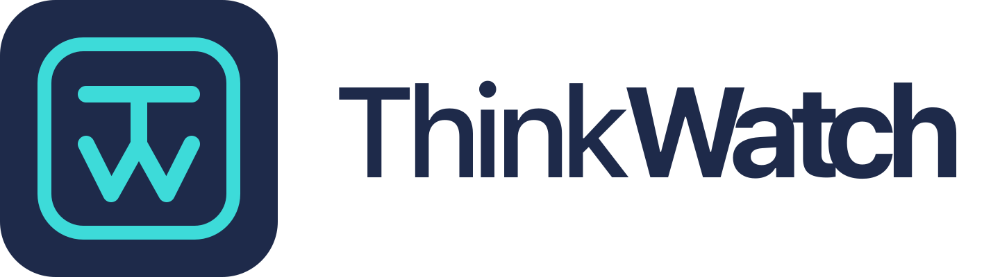

<p align="center">
  <picture>
    <source media="(prefers-color-scheme: dark)" srcset="assets/logo-dark.png">
    
  </picture>
</p>

<p align="center">
  
  
  
  
  
  
</p>

# ThinkWatch

**[English](README.md) | [中文](README.zh-CN.md)**

**面向组织自托管的 AI API 与 MCP 网关。** 组织内的每一次模型请求和 MCP 工具调用都经过同一个网关：以组织的身份系统认证，按限流与预算检查，经安全防护审查，核算费用并写入审计日志。它在 AI 访问中的作用，相当于堡垒机在服务器访问中的作用。

**个人开发者**：[ThinkWatch Lite](https://github.com/ThinkWatchProject/ThinkWatch-Lite) 是免费的桌面应用（MIT 许可证），在 macOS、Windows 与 Linux 上为 Claude Code、Codex 等 AI 客户端运行本地网关。

**赞助商**：[想出现在这里吗？](mailto:fylorn@outlook.com?subject=ThinkWatch%20Lite%20Sponsorship)

```
                    ┌──────────────────────────────────────┐
 Claude Code ──────>│                                      │──> OpenAI
 Cursor ───────────>│    Gateway  :3000                    │──> Anthropic
 自定义 Agent ─────>│    AI API + MCP                      │──> Google Gemini
 CI/CD 流水线 ─────>│                                      │──> Azure OpenAI / AWS Bedrock
                    └──────────────────────────────────────┘
                    ┌──────────────────────────────────────┐
 管理员浏览器 ─────>│    Console  :3001                    │
                    │    管理界面 + 管理 API               │
                    └──────────────────────────────────────┘
```

## 主要特性

- **MCP 工具调用以真实用户身份执行。** 每位用户通过 OAuth 或个人令牌连接自己的 GitHub、Notion、Linear、Slack、Atlassian 等账号，上游自身的审计日志因此能记录到具体操作人。令牌加密存储，工具列表按用户分别缓存，每个工具可以按角色和按 API Key 授权。
- **每个请求都经过安全防护。** 出站脱敏在请求发往上游前，把请求中任何位置的凭据和个人信息替换为 `<<TW_EMAIL_1>>` 这样的占位符，并在回答中还原，流式回答同样适用。工具调用审查按危险命令规则检查响应中的工具调用；内容过滤查找调用方发来内容中的提示词注入语句和隐藏字符，按规则拒绝请求、删除命中的文字或仅记录。
- **身份来自组织目录。** 登录可对接任意 OIDC 提供商（Zitadel、Okta、Azure AD 等），并可启用 TOTP 两步验证。从超级管理员到观察者的五个内置角色以及自定义角色，决定每个人可用的模型、工具和管理页面。
- **AI 与 MCP 共用一把密钥。** 用户获得 `tw-` 虚拟密钥，可限定用于 AI 网关、MCP 网关或两者。密钥只以哈希形式保存，轮换时保留宽限期。
- **限流与预算。** 从一分钟到一周的滑动窗口可限制请求数或 Token 数，按日、周、月的预算控制总用量。两者均可设置在用户、API Key 或角色上，限流同样适用于 MCP 工具调用。
- **可用于财务核算的费用统计。** 费用可按模型、用户、上游和成本中心汇总，支持导出 CSV 分摊报表，并给出月末费用预测。按模型设置的权重使价格较高的模型在同一配额中计入更多用量。
- **审计记录存入 ClickHouse。** 每一次模型请求和工具调用都记录用户、参数、响应、延迟与错误，留存的正文可在写入前按出站脱敏规则脱敏（默认关闭）。审计事件可通过 Syslog、Kafka（经 REST 代理）或签名 Webhook 转发至 SIEM。
- **所有客户端共用一个入口。** OpenAI Chat Completions、OpenAI Responses、Anthropic Messages 与 Gemini 请求在同一端口提供，并转换为上游所用的格式。路由可按权重、延迟或健康状况分配流量，熔断器会将持续出错的上游移出轮转。

## 快速开始

```bash
# 1. 启动基础设施
make infra

# 2. 生成 dev 密钥并启动后端 (gateway :3000 + console :3001)
make dev-secrets       # 从 .env.example 派生 .env，并填入随机密钥
make dev-backend

# 3. 启动前端开发服务器
cd web && pnpm install && pnpm dev

# 4. 在 http://localhost:5173/setup 完成设置向导
```

设置向导会创建首个超级管理员账号、设置站点名称并签发第一把 API Key；上游在之后的控制台中添加。此后控制台提供 Claude Code、Cursor、Continue、Cline、OpenAI 与 Anthropic SDK 以及 cURL 的配置说明，可直接复制使用。

## 部署方式

| 方式 | 命令 | 说明 |
|---|---|---|
| Docker Compose | `make deploy` | 首次运行时生成带随机密钥的 `.env.production` |
| Kubernetes | `make helm-deploy` | Helm Chart 位于 `deploy/helm/think-watch`；密钥在安装时生成，升级时保留 |

客户端只需访问网关（端口 `3000`）。控制台（端口 `3001`）提供管理界面与管理 API，应置于 VPN 或防火墙之后。TLS、安全加固与生产配置见 **[部署指南](https://thinkwat.ch/zh-CN/docs/deployment-guide)**。

## 行为说明

**MCP 身份**
- 同一用户可为一个服务器连接多个账号（例如工作账号与个人账号），并将每把 `tw-` 密钥固定到其中一个。
- 添加服务器只需填写地址：网关自动发现 OAuth 端点，上游支持动态客户端注册时自动完成注册。MCP 应用商店内置 37 个现成模板。
- 尚未连接账号的用户仍能看到工具列表；调用工具时返回 JSON-RPC 错误 `-32050` 并附带授权地址，符合规范的 MCP 客户端可据此引导授权。
- 使用每用户凭据的服务器，其响应按用户和账号分别缓存，不会共用。

**安全防护**
- 三项防护各有三档：关闭、观察，以及按其作用命名的第三档——出站脱敏为「替换」，工具调用审查为「切断」，内容过滤为「处置」。新安装时三项都处于观察档：命中只写入审计日志，切换到第三档之前不改动任何请求。
- 控制台的安全页列出每一条规则，内置规则和自定义规则都在其中。内置规则可以启用或停用，工具调用规则和内容规则可以改变处置，也可以添加自定义规则；切换之前可先用一段文本测试单条规则或整项防护。
- 出站脱敏查找整个请求，包括系统提示和之前的回答，但不查 base64 载荷。命中的内容替换为 `<<TW_标签_序号>>`（凭据为 `SECRET`，个人信息为 `ID_NUMBER`、`CARD_NUMBER`、`EMAIL`、`PHONE`，自定义规则使用自己的标签），并在回答中还原。邮箱地址和手机号规则出厂关闭。
- 内容规则按关键词、正则表达式或码位（`U+200B`、`U+E0000–U+E007F`）匹配，命中后拒绝请求、从调用方消息和工具结果中删除命中的文字，或仅记录。隐藏字符属于内容规则：Unicode 标签字符和双向控制符出厂开启，零宽字符和私用区字符出厂关闭。
- 工具调用规则在该调用处切断响应，或仅记录。除危险命令规则外，另有「发送凭据到陌生主机」和「上传本地文件到外部主机」两条内置规则。
- 模型的「最大输出 token」在模型页设置，限制发往该模型的每个请求的 `max_tokens`，取代原来的输出长度护栏。

**限流与预算**
- 所有限流与预算都在请求发出前按此前的用量检查；Token 在响应返回后计入，因此单个请求可能越过 Token 限制或预算，此后的请求才会被拒绝。被拒绝的请求不计入任何限制，其 `429` 响应以 `Retry-After` 说明限制何时解除。
- 设置在 API Key 上的限制叠加在其所属用户的限制之上，单独计数。
- Redis 不可用时，限流默认放行；设置 `security.rate_limit_fail_closed` 后改为拒绝请求。
- 预算提醒在每个周期内于 50%、80%、95% 和 100% 各触发一次。

## 文档

产品介绍：**[thinkwat.ch/zh-CN/thinkwatch](https://thinkwat.ch/zh-CN/thinkwatch)** · 完整文档：**[thinkwat.ch/zh-CN/docs](https://thinkwat.ch/zh-CN/docs)**

| 文档 | 说明 |
|---|---|
| [架构设计](https://thinkwat.ch/zh-CN/docs/architecture) | 系统设计、双端口模型、数据流 |
| [部署指南](https://thinkwat.ch/zh-CN/docs/deployment-guide) | Docker Compose、Kubernetes、TLS、生产加固 |
| [配置说明](https://thinkwat.ch/zh-CN/docs/configuration) | 环境变量与各项设置 |
| [API 参考](https://thinkwat.ch/zh-CN/docs/api-reference) | 网关与控制台的端点 |
| [安全模型](https://thinkwat.ch/zh-CN/docs/security) | 认证模型、加密、RBAC、威胁模型 |
| [密钥轮换](https://thinkwat.ch/zh-CN/docs/secret-rotation) | 轮换上游密钥、JWT Secret 与管理员凭据 |

## 基于 ThinkWatch Core

ThinkWatch 使用 [ThinkWatch Core](https://github.com/ThinkWatchProject/ThinkWatch-Core)（MIT）中的四个 crate：`tw-dialect` 负责接口格式转换与用量解析，`tw-guard` 负责脱敏、工具调用审查及其他防护，`tw-breaker` 提供熔断状态机，`tw-bedrock` 负责 Amazon Bedrock 的请求签名、事件流解析与模型目录。

[ThinkWatch Lite](https://github.com/ThinkWatchProject/ThinkWatch-Lite) 是面向个人开发者的桌面版，在 macOS、Windows 和 Linux 上为 Claude Code、Codex 等客户端提供本地网关（MIT）。

## 贡献

欢迎贡献。提交大型变更前请先开 Issue 讨论。

## 授权协议

ThinkWatch 采用 [Business Source License 1.1](LICENSE) 进行源码可见分发。
非生产用途可免费使用。生产用途在每个 UTC 自然月内，同时不超过
`10,000,000` Billable Tokens 且不超过 `10,000` MCP Tool Calls 时可
免费使用；任一指标超出阈值后，需购买按使用量梯度计费的商业授权。

具体的生产阈值、Billable Tokens 与 MCP Tool Calls 定义、梯度方案
以及后续切换到 `GPL-2.0-or-later` 的规则，见
[LICENSING.zh-CN.md](LICENSING.zh-CN.md)。
